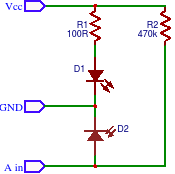

# IR Barrier Sensor with LED always turned on


Barrier/distance IR sensor Arduino library  working with lightness changes

* + Can measure without any dalays<br/>
* - **Don`t sees difference between barriers and light * ([look below](#-barrier-differentiation-problem))**<br/>
* - Needs more power for LEDs<br/>
* - Small sensivity and can`t detect black objects * ([look below](#-sensivity-problem))<br/>

For higher sensivity and better barrier differentiation use <a href="https://github.com/el-fuego/IRBarrierSensorPulsedLED">IRBarrierSensorPulsedLED</a>

#### Circuit 


Vcc is +5V. <br/>
Use higher LED resitor impedance for higher voltage or lower for lower voltage

#### Example
```cpp
#include <IRBarrierSensor.h>

// setup pin
const int barrierSensorPin = A3;

void setup() {
  // declare the LED pin as an OUTPUT:
  pinMode(LED_BUILTIN, OUTPUT);
}

IRBarrierSensor barrierSensor(barrierSensorPin);

void loop() {
  // turn ON builtin LED if barrier is detected
  digitalWrite(LED_BUILTIN, barrierSensor.hasBarrier() ? HIGH : LOW);
  
  delay(100);
}
```

#### Advanced configuration
```cpp
const int barrierSensorPin = A3;
const float sensivityLevel = 0.15; // 0.0..1.0
const int calibrationInterval = 500;  // 100..5000 ms is recommended

IRBarrierSensor barrierSensor(
  barrierSensorPin,
  sensivityLevel,
  calibrationInterval
);
```

#### Algorithm
1. Calibrate sensor (store sensor value) on robot power ON and every n seconds (0.5 by defaults) if barrier is not detected
2. Calculate deviation between calibrated and current value
3. Barrier is detected when deviation is more than limit

#### * Barrier differentiation problem
For example, for me sensor value at 
* darkness = 1024
* evening with lights turned on = 1000
* rainy day at shadow = 50
* sunshine at shadow = 20
* sunshine (sensor is not turned to sun) = 2
* at evening wiht barrier at 20mm = 400
* at evening wiht barrier at 10mm = 200
* at evening wiht barrier at 3mm = 20

So, use **senfor screening** from daylights, if you want to use this algorithm

```
   black         sun rays
   screen        / / / / /
------------------/     /
sensor=)        \/     /
------------------ \  /
___ground___________\/__
```

### * Sensivity problem
Use powerful or few LEDs
